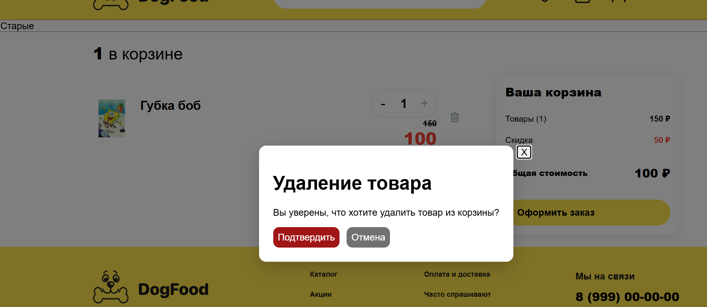
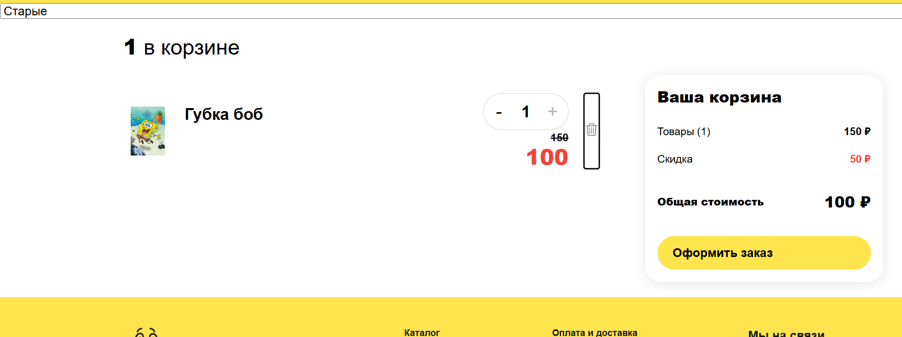
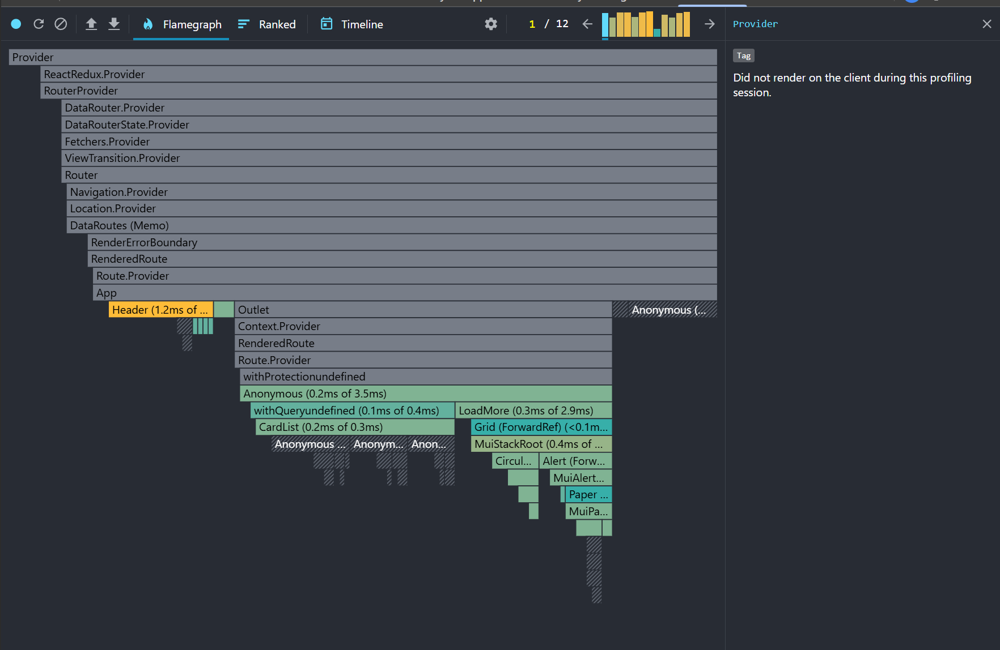
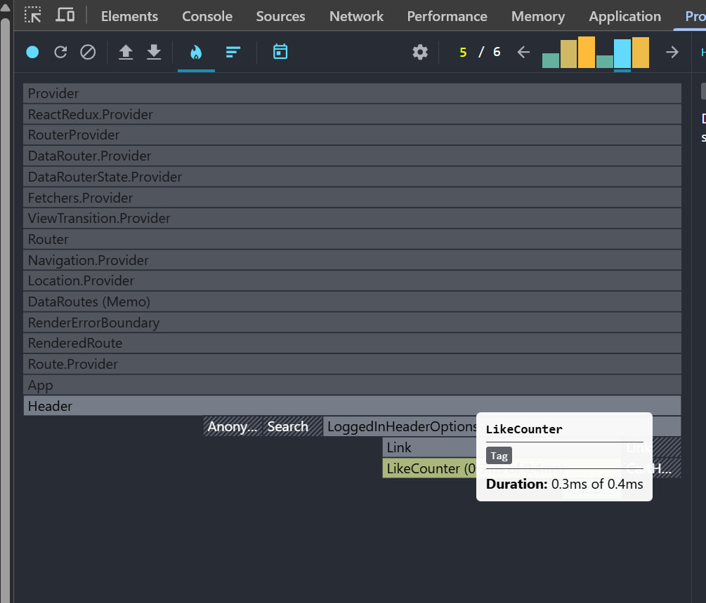
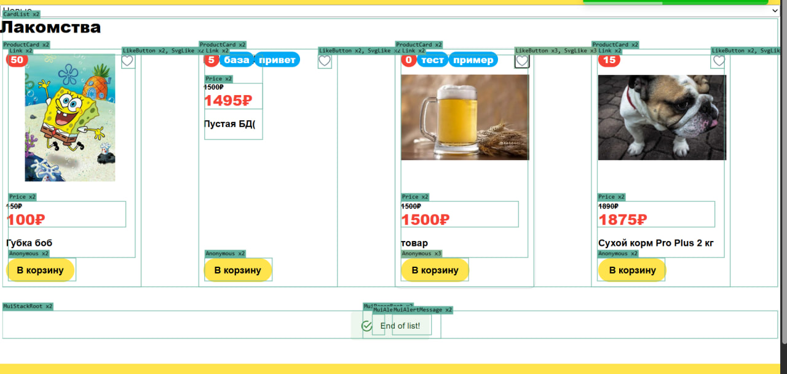
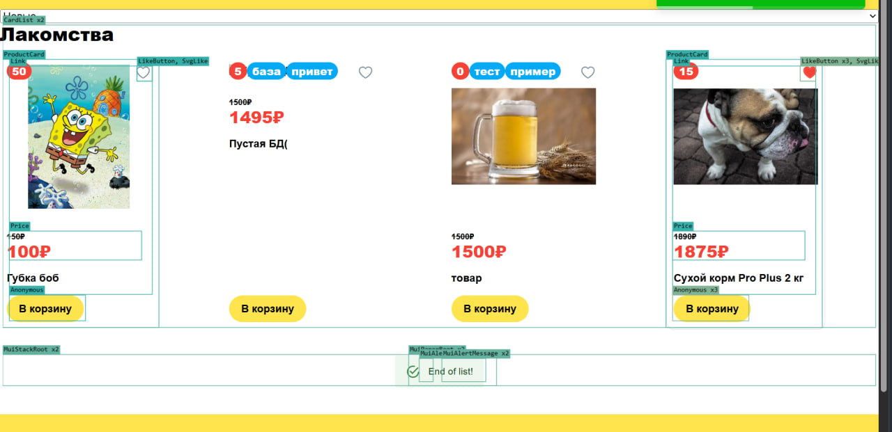
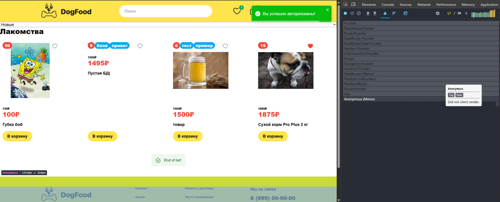
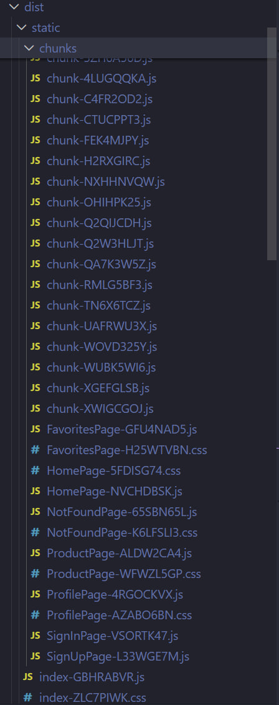
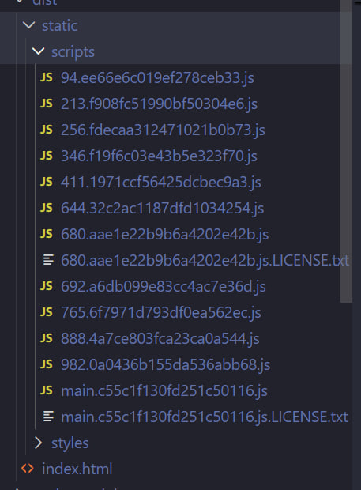

# Итоговый проект по курсу react pro (сборка на webpack)

# Проект на esbuild лежит в ветке esbuild

## Запуск проекта локально:

- `npm i` - установка зависимостей
- `npm run start:webpack` - запуск проекта
- `npm run start:webpack` - запуск проекта

#### 1. Оптимизация

Проект разбит по папкам в соответствии с архитектурой FSD

Произведён рефакторинг кода:

- 1.Мемоизация компонентов с тяжёлым рендером
- 2.Вынос useSelector'ов из компонентов верхнего уровня в компоненты, где они действительно нужны
- 3.Удалены лишние стили, не используемые в проекте

#### 2. Структура проекта

- index.tsx - точка входа в приложение
- /app - корневой компонент и роутинг
- /pages - страницы сайта
- /widgets - верхнеуровневые компоненты, сочетающие в себе несколько фич\сущностей (список товаров, шапка с разделом, доступным только авторизованным пользователям)
- /features - формы авторизации и регистрации, редактирования профиля; компоненты с полноценной бизнес-логикой: добавить в избранное, в корзину, написать отзыв, поиск по товарам
- /entities - презентативные компоненты без полноценной бизнес-логики (информационное содержимое карточки\страницы товара)
- /shared - базовые компоненты (кнопки, поля ввода, индикаторы загрузки), апи сайта и стор

#### 3. Что удалось сделать

1. Форма на нативном React 19 (useActionState)
   

2. Модальное окно на React Portal с фокусировкой на кнопке закрытия и с закрытием на клавишу ESC
   

   2.1 Фокус на кнопке вызова модального окна при закрытии оного
   

3. Форма написания отзыва о товаре с использованием useOptimistic (работает сомнительно)
   

#### 4. Наглядное сравнение оптимизации рендеров и хотспот

A. Header хранил в себе много бизнес логики и селекторов, что вызывало регулярную перерисовку

После декомпозции и выноса useSelector в отдельный компонент, частота рендеров снизилась, хотспот был убран

Б. Карточки товаров в списке перерисовывались при каждом добавлении\удалении отдельно взятого товара в избранное (что-то рендерилось даже неоднократно)

Мемоизация карточек значительно снизила лишние рендеры

В. Как полностью статический компонент, футер был мемоизирован и отрисовывается лишь раз

#### 5. Оптимизация бандла

- Страницы разделены на чанки

#### 6. Сравнение сборок webpack и esbuild

- 1. У webpack более развитая инфраструктура, легко подключить плагин и автоматизировать часть сборки, однако он значительно медленне как в прод, так и в дев сборках
- 2. У esbuild чрезвычайно высокая скорость сборки и более мелкое разбиение на чанки, меньше лишнего грузится за раз
- 3. Вот так выглядит сборка esbuild
     
- 4. А вот так - у webpack
     
- 5. Вывод: с учётом сильно развитой инфраструктуры webpack пока выигрывает в сборках enterprise уровня проектов, где esbuild привёл бы к большому количесту ручной работы.
     Однако для проектов среднего и малого уровня webpack стал выглядеть инструментом слишком большого масштаба, здесь правит esbuild и любой другой компактный шустрый сборщик
